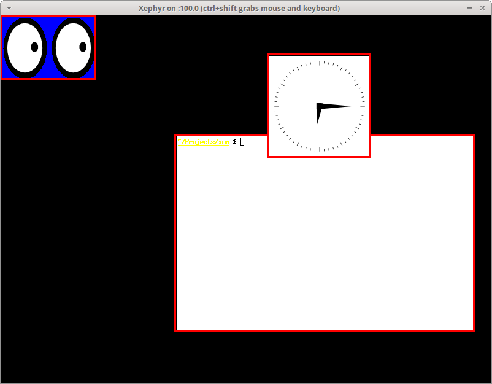

Basic Window Manager
====================

vx_win is a fork of basic_wm, created by [Chuan Ji](https://github.com/jichu4n) a.k.a. `@jichu4n)`. 

vx_win is a simple reparenting, non-compositing X window manager that demonstrates
how to implement the fundamental functionality of a window manager:

  * Managing the life cycle of windows
  * Reparenting windows
  * Basic window operations (moving, resizing, closing)

basic_vm serves as an example for his series of articles,
[_How X Window Managers Work, And How To Write One_](https://jichu4n.com/posts/how-x-window-managers-work-and-how-to-write-one-part-i/).

Building and Running
--------------------

To build this example window manager, you will need:

* A C++-20 enabled C++ compiler
* [CMake](https://cmake.org/)
* Xlib headers and libraries
* [google-glog](https://code.google.com/p/google-glog/) library

To run and test it, you will need:

* [Xephyr](http://www.freedesktop.org/wiki/Software/Xephyr/)
* `xinit`
* Random X utilities such as `xclock`, `xeyes`, and `xterm` to play with

On [Ubuntu](https://www.ubuntu.com)/[Debian](https://www.debian.org/), you can
install these dependencies with:

    sudo apt-get install \
        build-essential libx11-dev libgoogle-glog-dev \
        xserver-xephyr xinit x11-apps xterm

On [Fedora](https://getfedora.org)/[CentOS](https://www.centos.org), you can install these with:

    sudo yum install \
        make gcc gcc-c++ libX11-devel glog-devel \
        xorg-x11-server-Xephyr xorg-x11-apps xterm

On [Arch Linux](http://www.archlinux.org), you can install these with:

    yaourt -S base-devel libx11 google-glog \
        xorg-server-xephyr xorg-xinit xorg-xclock xorg-xeyes xterm

Consult your own distro's documentation for how to install these.

Once you have all the dependencies, building and running it is as simple as:

    ./build_and_run.sh

This will launch a simple Xephyr session like in the following screenshot:

Usage
-----

Supported keyboard shortcuts:

* **Alt + Left Click**: Move window
* **Alt + Right Click**: Resize window
* **Alt + F4**: Close window
* **Alt + Tab**: Switch window

